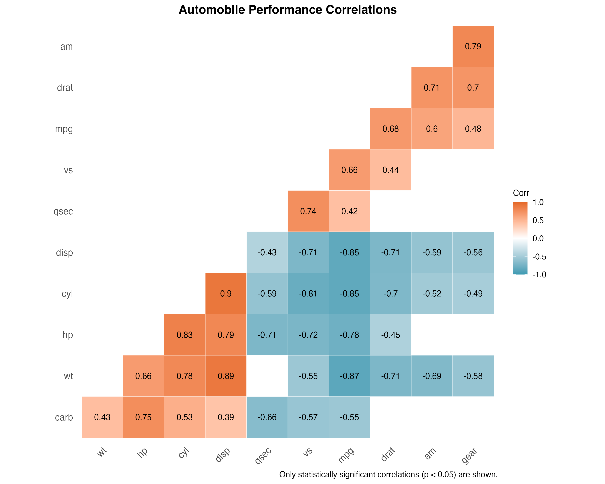
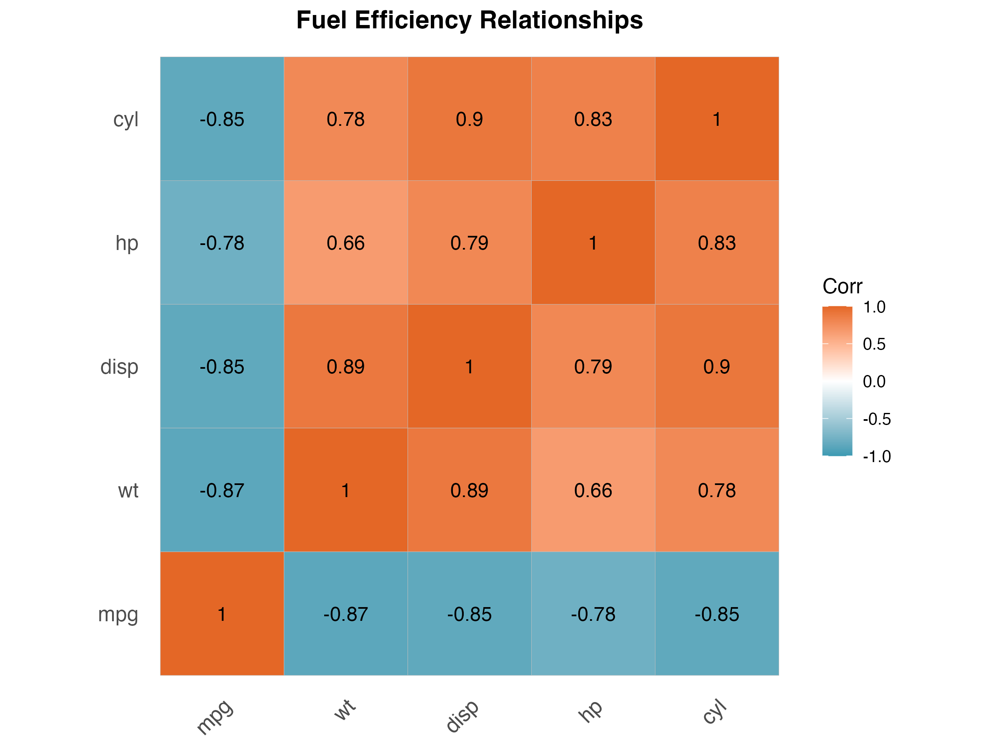

## ggcorrplot (Correlation Matrix Visualization in R)

https://rpkgs.datanovia.com/ggcorrplot/

### Package Motivation & Core Functionality

Correlation matrices help identify relationships between variables, but standard tables of correlation coefficients can be difficult to interpret (especially with many variables). The `ggcorrplot` package solve this problem by transforming correlation data into visualizations using ggplot2's "grammar of graphics".

ggcorrplot, developed by Alboukadel Kassambara, offers a number of advantages:

1. Hierarchical clustering algorithms group similar variables, revealing patterns that might otherwise be hidden in a standard correlation table.

2. The package can highlight or blank out correlations that fail to meet a significance threshold, helping analysts focus on meaningful relationships and avoid misinterpreting random noise.

3. Different methods (like squares, circles) represent correlation strength and direction through size and color, making patterns immediately apparent.

4. Lower or upper triangle options reduce redundancy and create cleaner visualizations.

5. Correlation values can be labeled directly on the visualization, combining visual and numerical information.

6. Building on ggplot2, the package allows for comprehensive aesthetic control over colors, themes, and text elements.

When put together, the package takes raw correlation data and transforms it into an analytical tool which far exceeds the capabilities of traditional corr tables.

### Example: Analyzing Automobile Performance (with `mtcars`)

To demonstrate ggcorrplot's usecase, I'll analyze the classic `mtcars` dataset, which contains performance metrics for various automobile models from Motor Trend magazine.

```r
library(ggcorrplot)
library(ggplot2)
data(mtcars)

# we will compute correlation matrix and p-values
corr_matrix <- cor(mtcars)
p_matrix <- cor_pmat(mtcars)

# then put together a visualization
plot_enhanced <- ggcorrplot(
  corr_matrix,
  hc.order = TRUE,          # hierarchical clustering
  type = "lower",           # show only lower triangle
  p.mat = p_matrix,         # p-value matrix
  sig.level = 0.05,         # significance threshold
  insig = "blank",          # blank out non-significant correlations
  lab = TRUE,               # show correlation coefficients
  method = "square",        # use squares
  colors = c("#3B9AB2", "white", "#E46726"),    # as always, colorblind-friendly :D
  title = "Automobile Performance Correlations"
) +
  theme(
    plot.title = element_text(face = "bold", hjust = 0.5),
    axis.text.x = element_text(angle = 45, hjust = 1)
  ) +
  labs(caption = "only statistically significant correlations (p < 0.05) are shown.")
```



The fully-fledged visualization reveals the complex dependencies and interrelationships among all variables in the dataset (this is one of the main reasons I like this dataset). To focus specifically on fuel efficiency factors, I also created a targeted visualization:

```r
efficiency_vars <- c("mpg", "wt", "hp", "disp", "cyl")
plot_focused <- ggcorrplot(
  cor(mtcars[, efficiency_vars]),
  lab = TRUE,
  lab_size = 4,
  method = "square",
  colors = c("#3B9AB2", "white", "#E46726"),
  title = "Fuel Efficiency Relationships"
)
```



The focused visualization tells us the following:

1. The strongest negative correlation with MPG is weight (-0.87), suggesting that lightweight construction is the most effective way to improve fuel economy.
2. Engine characteristics (displacement, horsepower, cylinders) are all highly correlated with each other, forming a distinct cluster through hierarchical ordering.
3. The sharp color contrast between blue (negative correlations) and orange (positive correlations) instantly communicates the fundamental engineering trade-off between performance and efficiency.

Creating these visualizations would be challenging without ggcorrplot. In fact, I have worked with this dataset many times, and using this package is probably the best way I have found to visualize these correlations. The package handles complex tasks like hierarchical clustering, significance filtering, and strategic layout design through a simple interface. The result is an information-rich and easy-to-read visualization that transforms correlation data into actionable insights about automotive design.

In summary, this is a great example of how ggcorrplot helps analysts move beyond simple correlation tables to discover deeper patterns and relationships within their data. It is a worthwhile addition to any data scientist's r package toolkit.
