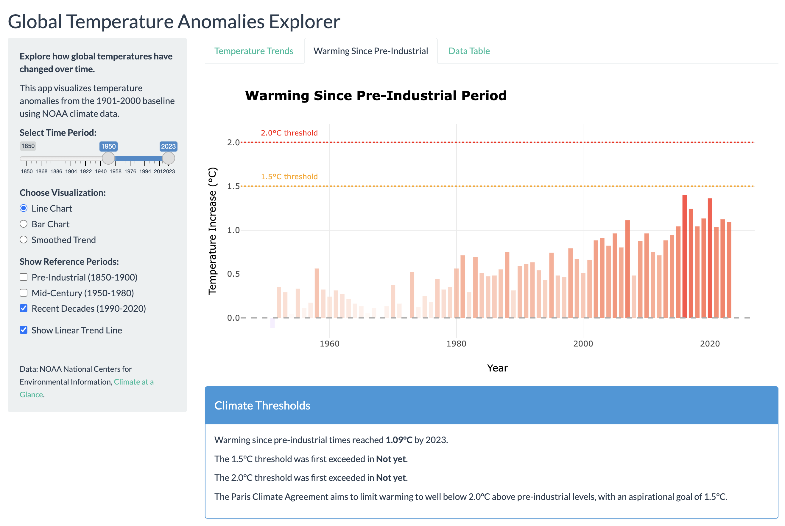

# Writeup
## Introduction

My Shiny app visualizes NOAA Global Temperature Anomalies data. This dataset represents deviations from the 1901-2000 baseline and encompasses over 170 years of global temperature measurements.  The application addresses a fundamental visualization challenge: how to effectively communicate long-term climate trends while accounting for the variability inherent in the problem space. I attempt to tackle this by introducing interactive parameters (in particular, time period selection, various visualization methods, reference period toggles, and moving average trend analysis). In general, the dashboard enables the audience to explore across different temporal scales. The primary objective, which I believe my Shiny accomplishes well, is to allow users to investigate climate change metrics through an interactive, data-driven interface.

<br/>
<div align="center" style="width: 75%; margin: 0 auto;">
  
  <p style="text-align: center; font-style: italic; margin-top: 8px;">Figure 1: One of the Dashboard views, depicting warming since the Pre-Industrial period.</p>
</div>

### Run it yourself

Change directory and then run the script yourself with:
```
Rscript -e "shiny::runApp("script.R"")"
```

or within the R command prompt using:
```r
shiny::runApp("script.R")
```

or open in RStudio and click Run App.

## Interesting Findings

Exploratory analysis confirmed my hypothesis and revealed significant temporal patterns in global temperature anomalies. Quantitative assessments show a non-stationary warming trend. The rate of temperate increase is accelerating. In particular, the rate increase was approximately 0.08°C per decade in the early dataset (1900-1950), and in recent years has increased to 0.18°C per decade (1990-2023). That comes out to a 125% increase in warming velocity.

### The data supports claims of Human-caused (anthropogenic) warming

When comparing temperature patterns across different time periods, I discovered something interesting about how global temperatures behave. Before 1950, temperatures fluctuated quite erratically relative to their average values. However, after 1990, while temperatures were higher overall, they showed more consistent year-to-year patterns:

```bash
Pre-1950 Period:
  Mean of absolute anomalies: 0.232
  Standard deviation: 0.211
  Coefficient of variation: 0.911

Post-1990 Period:
  Mean of absolute anomalies: 0.679
  Standard deviation: 0.297
  Coefficient of variation: 0.437
```

Specifically, the coefficient of variation (a measure of relative variability) decreased from 0.91 in the pre-1950 period to 0.44 in the post-1990 period. This substantial change suggests that climate variability has fundamentally shifted. In earlier decades, natural factors created more chaotic temperature patterns, but in recent decades, human-caused warming has become the dominant force, creating a stronger and more consistent warming trend that stands out clearly from background climate noise.

This finding helps explain why climate scientists are so confident about detecting human influence on climate - the signal has become much clearer against the background noise. 

## Interface Creation Process
I tried to balance simple computations with visual effectiveness. I preformed minimal preprocessing of the raw NOAA dataset. However, I did need to do a lot of computations for derivative metrics like relative warming indices, moving addresses, and period-specific trend coefficients.

When designing the UI, I followed principles of information hierarchy and used experience from my past internships. Control parameters were sequenced logically: temporal filtering was the primary parameter, followed by contextual toggles.

The color gradient I selected (sequential blue-white-red) addresses colorblind accessibility while intuitively representing temperature derivations. Lines on the plot utilize dashed patterns and color channels to ensure separability from primary data representations. Since I was working time series, I elected to use multiple visualization methods (line plots for continuity, bar charts from discrete comparison, and LOESS smoothing for trend isolation) as these represent the different aspects of the format.

The interactive element addresses the need for varying degrees of granularity. The time range selector enables users to quickly drill through, while the various visualization toggles take advantage of pre-computed data transformations to minimize latency.

## Reactive Structure
The app's reactivity framework starts with `all_data` to load the dataset once, and `filtered_data` to apply time range selections. The app processes time range selections only when needed.

Specialized reactives handle specific calculations: `period_averages` computes reference values for historical periods, while `warming_data` calculates warming relative to pre-industrial levels. I elected to isolate more complex operations like  trend analysis in their own dedicated reactives to make sure they only run once per data change but can feed multiple visualizations and summaries.

In general, the structure is built to respond to user interactions. Toggling visualization types updates only the visual representation without recalculating statistics. Showing reference periods affects only specific plot elements without triggering broader recalculations.

