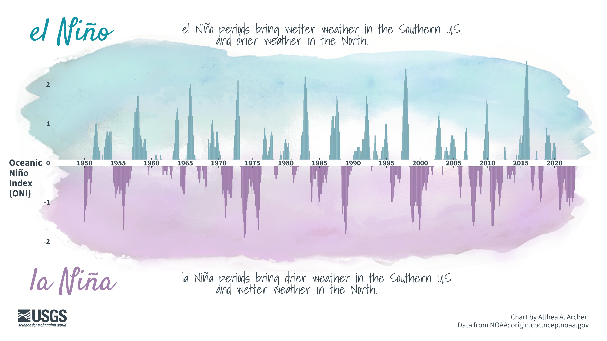
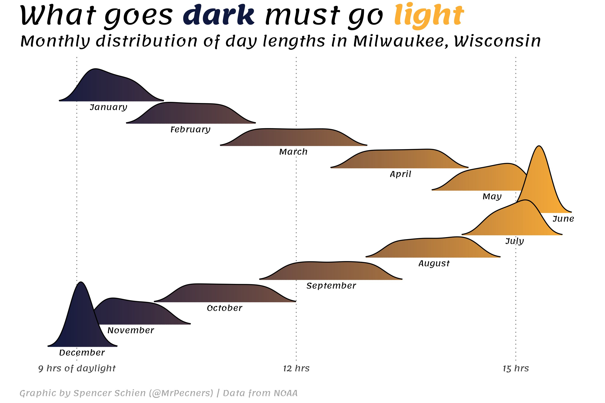
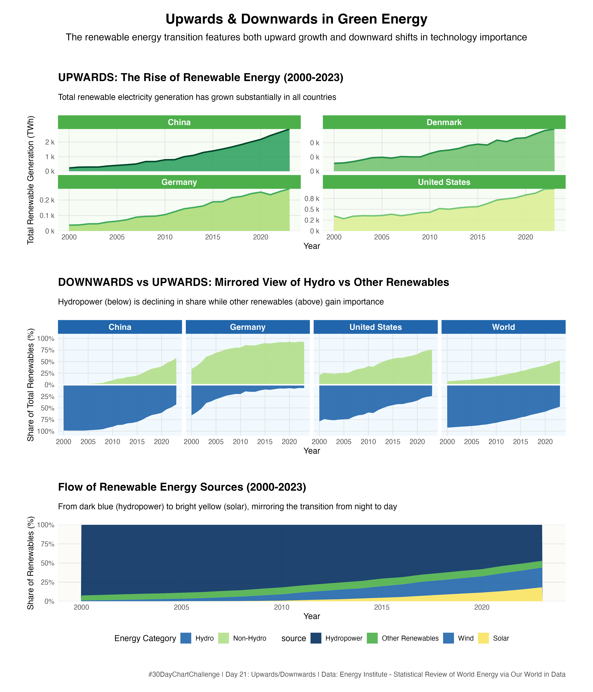

HW3: Upwards & Downwards in Green Energy for 30-Day Chart Challenge

## Initial Brainstorming

When approaching the "upwards/downwards" prompt with green energy data[^1], I considered visualizations which could capture movement and directional trends over time:

1. The rise of renewable energy adoption contrasted with the decline of fossil fuels
2. Opposing trends in carbon emissions versus clean energy investment
3. The fall of renewable technology costs against the increase in installation capacity
4. Geographic variations showing which regions are trending up or down in renewable adoption

The main challenge I anticipated was effectively showing diverging trends in a single visualization without creating confusion. I would need to balance the upward trajectories (like solar and wind growth) with downward movements (like hydropower's diminishing share) in a way that creates a cohesive narrative that is appealing and easy to understand for a given viewer.

## Analysis of Existing Submissions

### Submission 1: El Niño/La Niña Visualization by Althea A. Archer

I really liked this one. This visualization by Althea Archer brilliantly demonstrates the "upwards/downwards" concept through mirrored area charts. The upward blue spikes representing El Niño are visually balanced against the downward purple areas showing La Niña conditions.

What makes this effective for a directional theme is the clear mirroring technique and color differentiation. In particular, the design creates intuitive visual understanding of opposing weather patterns while maintaining data integrity. I could adapt this approach to show the rise of renewables against the fall of traditional energy sources.

### Submission 2: "What goes dark must go light" by Spencer Schien

This visualization by Spencer Shien uses small multiples in a flowing arrangement to show the changing distribution of daylight hours throughout the year. I feel the visualization succeeds in successfully showing both upward trends (increasing daylight in spring/summer) and downward trends (decreasing daylight in fall/winter).

One thing I noticed was the color gradient. It reinforces the directional movement, making the pattern instantly recognizable. The smooth transitions between months create a sense of flow that I wanted to incorporate in my renewable energy visualization.

## My Visualization Approach

My visualization for the "upwards/downwards" theme implements three perspectives on renewable energy transitions, drawing inspiration from Shien and Archer's works.

The top panel shows rising renewable energy generation across China, Denmark, Germany, and the United States. The green palette reinforces growth while connecting to the "green energy" theme. China's dramatic curve contrasts the more gradual increases in Western economies. A faceted approach allows comparison across vastly different scales.

The middle panel uses Archer's mirroring technique to visualize opposing trends. Inspired by the El Niño/La Niña visualization, I positioned hydropower below the axis (blue) and other renewables above (green). This arrangement immediately communicates the shifting balance in renewable energy composition. As hydropower's importance decreases, the blue area shrinks, while the expanding green area represents the growing significance of newer technologies.

The bottom panel incorporates Schien's flowing color gradient concept. Moving from dark blue through green to yellow, this chart mimics the night-to-day transition in Schien's work. This metaphor connects with the energy narrative -- traditional hydropower giving way to solar technology, just as night yields to day (Wow!)

### Design Decisions

I created a visualization that embodies the directional theme through its structure. In particular, the mirrored chart creates a physical manifestation of opposing movements within the same visual space.

Complementary color schemes maintain visual interest while ensuring unity -- green tones signal growth, blue-green contrast highlights opposing trends, and the blue-to-yellow gradient creates natural progression.

Background tinting provides context to each panel, while the sequence guides viewers through increasingly detailed perspectives from growth, to compositional shifts, to energy source transitions.

### Takeaways

The visualization reveals compelling directional stories: all countries show upward growth in renewable generation at different scales; the mirrored chart shows hydropower's declining share despite continued absolute growth; and the flowing chart demonstrates how newer technologies have gradually claimed space in the renewable portfolio.

These perspectives create a nuanced view of the renewable energy transition -- with upward and downward movements occurring simultaneously across different dimensions of the same system.

All in all, I am happy how things turned out.

[^1]: Green energy data retrieved from Our World in Data. https://ourworldindata.org/grapher/modern-renewable-energy-consumption.
