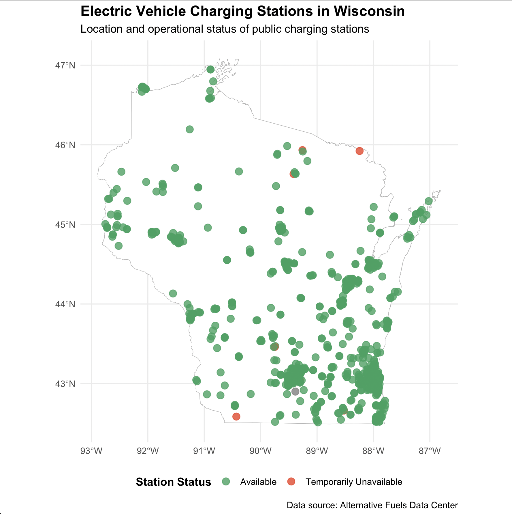
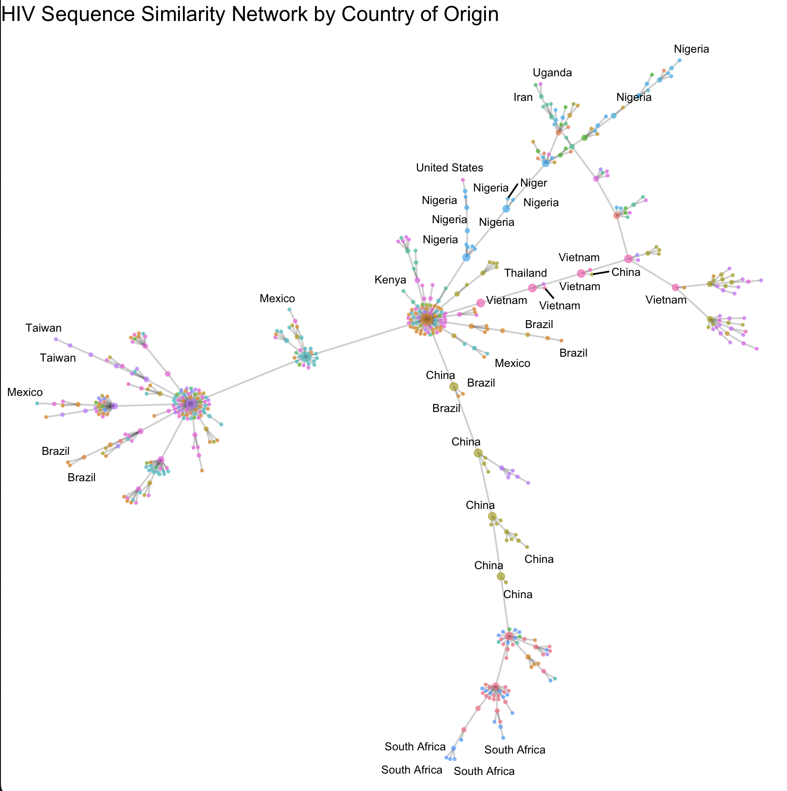
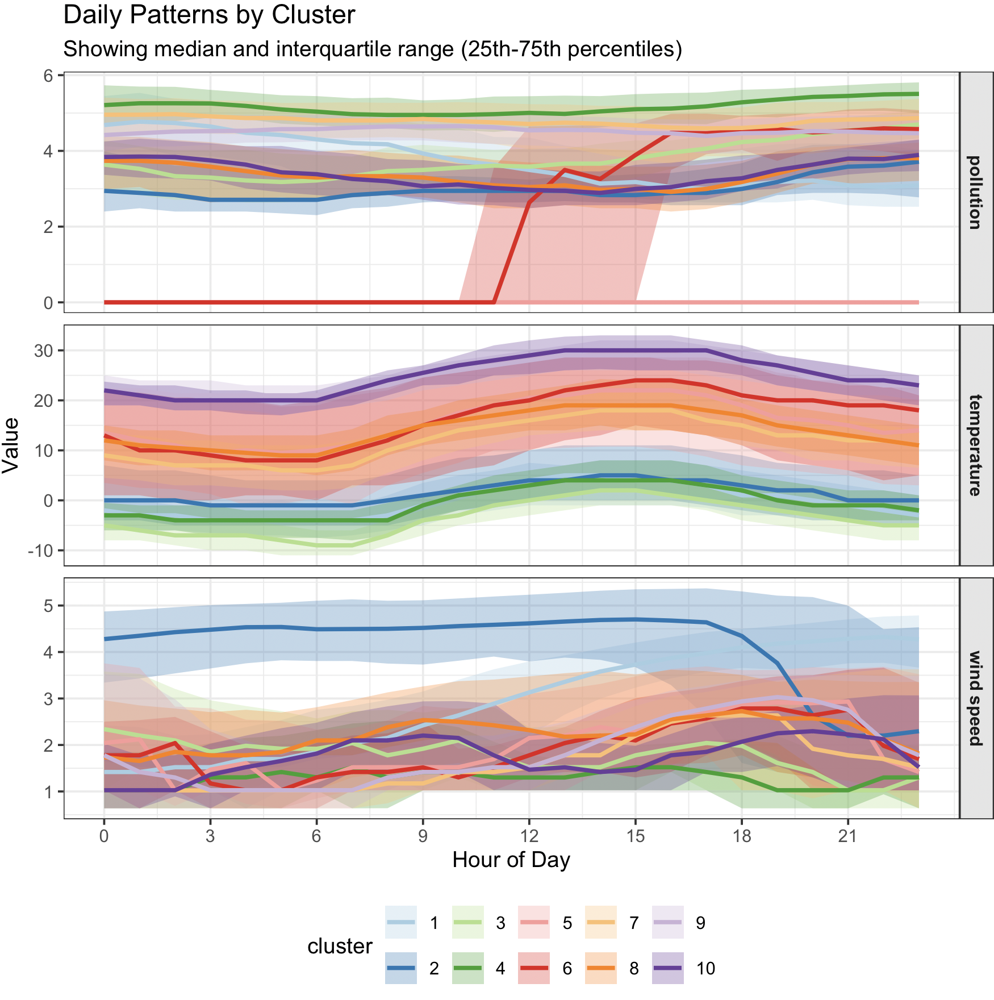
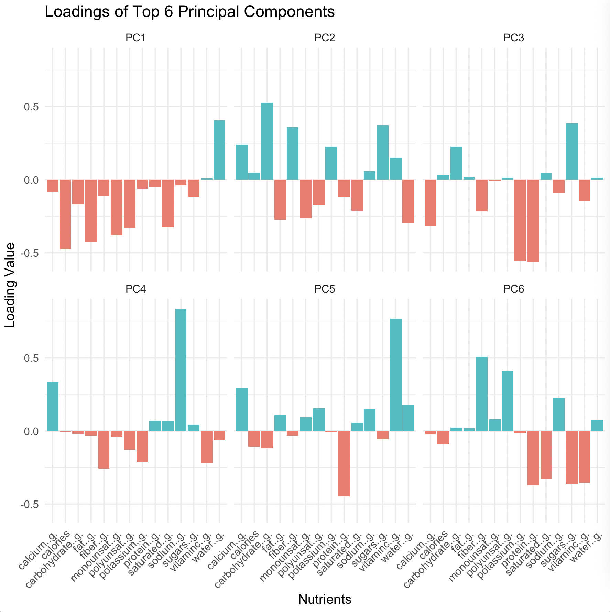
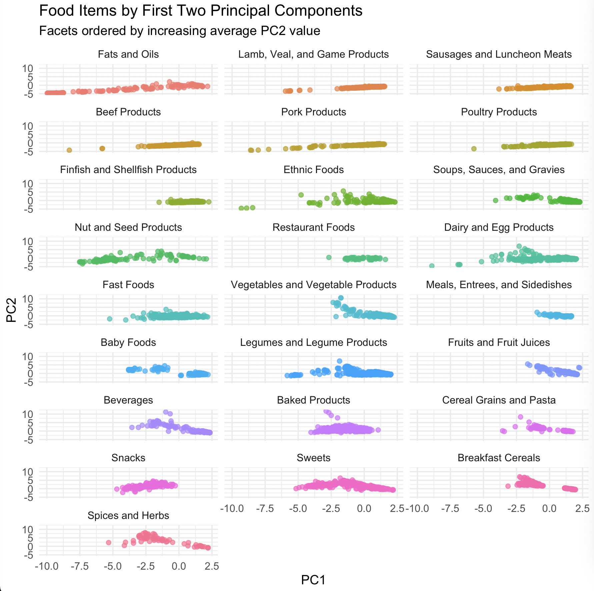
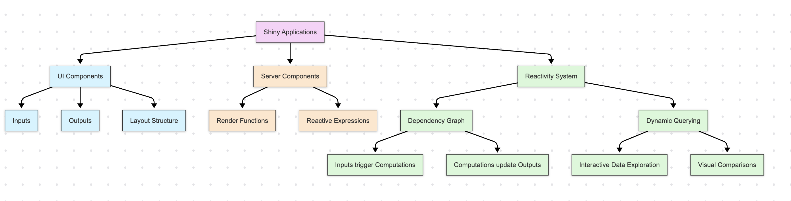

## HOMEWORK 4: STRUCTURED DATA + MODELS

### Code Diary

**a. Programming Environment/Workflow**
I primarily use [radian](https://github.com/randy3k/radian) in the command prompt alongside neovim to edit .R files and view rendered plots. For Shiny applications, I split my screen with a localhost Chrome tab on the right to see real-time updates as I code. I always use git.

**b. Planning Techniques**
When approaching a new visualization task, I focus on establishing control from the beginning rather than coding reactively. I start by clearly defining the visual objectives and data requirements. I sketch rough layouts on paper  before writing any code. For complex visualizations, I break down the implementation into logical components (data preparation, base plot creation, aesthetic refinements) and do them sequentially. And, of course, I also consult the documentation for unfamiliar packages to understand their capabilities (and cool features) before implementation.

**c. Bugs Encountered and Resolution**
The most common bugs I encountered were:
-	Data type mismatches: Resolved by explicitly converting variables using as.numeric(), as.factor(), etc., and verifying with str() or glimpse()
-	Unexpected NA values affecting calculations: Addressed by using na.rm=TRUE for summary statistics and implementing proper data cleaning steps
-	Aesthetic mapping issues: Fixed by carefully reviewing the ggplot layers and ensuring variables were properly mapped
-	Package dependency conflicts: Solved by loading packages in the correct order and using package::function() notation for ambiguous function calls

When debugging, I implemented a systematic approach: isolating problematic code sections, adding diagnostic print statements, and consulting error messages carefully before making changes.

**d. Future Approach Improvements**
If starting again, I would:
-	Create a more structured project directory with separate folders for data, scripts, and outputs
-	Write more modular functions for repetitive tasks to improve code reusability
-	Document my code more thoroughly with comments explaining the purpose of each major section. Sometimes I am writing a lot of code and comments can be helpful to understand the broader impact of the block.
-	Get a little better at making atomic git commits
-	Test visualizations earlier with small data subsets before scaling to the full dataset
 
### Geospatial Datasets

**a. NYC Building Footprints**
This is a vector dataset in GeoJSON format. It contains Polygon geometries.
*Reasoning:* The data follows GeoJSON structure with "type": "FeatureCollection" and features that contain "geometry" with "type": "Polygon". Each polygon is defined by arrays of coordinate pairs representing the vertices of building footprints. The coordinate structure [ [ [ lon1, lat1 ], [ lon2, lat2 ], ... ] ] is definitely characteristic of polygon geometries in GeoJSON.

**b. Africa Population 2020**
This is likely a raster dataset.
*Reasoning:* As I recall, population data is typically stored as a continuous surface where each cell (that is, each pixel) represents population count or density over an area. Based on Image 2, which shows a population density map of Africa with varying intensities, this confirms it's raster data -- in particular, darker areas likely represent higher population concentrations.

**c. Himalayan Glacial Lakes**
This is a vector dataset in TopoJSON format. It contains Polygon geometries.
*Reasoning:* The snippet shows a "Topology" type with "arcs" arrays containing coordinate pairs. The coordinate structure and the context (lakes) point to polygon geometries representing the outlines of many glacial lakes.

**d. Wisconsin EV Charging**
This is a vector dataset in GeoJSON format. It contains Point geometries.
*Reasoning:* The data structure has "type": "FeatureCollection" with features containing "geometry" of "type": "Point". Each point has a single coordinate pair representing the location of an EV charging station. The property attributes (FUEL_TYPE, STATION_NA, etc.) provide information about any given charging location.

**e. Zion Elevation**
This is likely a raster dataset.
*Reasoning:* Based on Image 1, which appears to show a digital elevation model (DEM) with grayscale values representing different elevations, this is certainly characteristic of raster data where each cell contains an elevation value. Elevation data is stored in raster format to capture the continuous nature of terrain.

**f. Visualization of Wisconsin EV Charging Stations**

The visualization displays the geographic distribution of EV charging stations across Wisconsin, with points color-coded to indicate their operational status (available or temporarily unavailable). This approach communicates the spatial distribution and current availability of charging infrastructure, which would be valuable for EV owners planning trips in WI. The state boundary provides necessary context and the points commmunicate the key information this visualization is providing. 
```r
library(sf)
library(ggplot2)
library(dplyr)

wi_ev <- st_read("wisconsin_ev.geojson")
wi_boundary <- st_read("wisconsin_boundaries.geojson")
# source: https://data-wi-dnr.opendata.arcgis.com/datasets/wisconsin-state-boundary-24k

ggplot() +
    geom_sf(data = wi_boundary, fill = "white", color = "gray70") +
    geom_sf(data = wi_ev, aes(color = STATUS_COD), size = 3, alpha = 0.8)+

    scale_color_manual(values = c("E" = "#2ca25f",
        "T" = "#f03b20"),
        name = "Station Status",
        labels = c("E" = "Available",
            "T" = "Temporarily Unavailable")) +

    labs(title = "Electric Vehicle Charging Stations in Wisconsin",
        subtitle = "Location and operational status of public charging stations",
        caption = "Data source: Alternative Fuels Data Center")+
    theme(
        plot.title = element_text(face = "bold", size = 14),
        plot.subtitle = element_text(size = 11),
        legend.position = "bottom",
        legend.title = element_text(face = "bold")
    )
```
### CalFresh Comparison

**a. Graphical Encoding Definition**
Graphical encoding refers to the process of mapping data values to visual properties (or channels) of graphical elements in a vizualization. These visual properties include position, size, color, shape, orientation, and texture, among others. Each encoding type has different perceptual characteristics that make it more or less effective for representing different types of data.

For example: In a scatter plot, we might encode a person's height using the y-position of a point, their weight using the x-position, their age using the color of the point, and their gender using the shape of the point. Here, position (y, x), color, and shape are all examples of graphical encodings.

**b. Comparison of Visualization Approaches**

*Approach 1 (Small Multiples Line Chart)*

Strengths:
- Clearly shows temporal patterns and trends for each county over the full time period
- Direct comparison of absolute unemployment values is straightforward within each county panel
- The consistent y-axis scale across panels allows for comparing unemployment magnitude between counties
- Color encoding for years makes it easy to track the dramatic 2020 unemployment spike (pink line) compared to previous years (yay, Covid!)

Weaknesses:
- Limited to displaying only six counties (a subset of the full dataset)
- Overlapping lines can create visual clutter, especially when values are close together
- Monthly patterns might be harder to compare across counties since they're in separate panels
- Requires more screen space to maintain readability compared to Approach 2

*Approach 2 (Heatmap)*

Strengths:
- Displays the entire dataset (all counties) in a single, space-efficient visualization
- The square root transformation of unemployment values helps highlight variations that might be obscured in raw values
- Color encoding creates a clear visual pattern showing the 2020 unemployment spike across all counties
- Excellent for identifying spatial and temporal clusters or anomalies

Weaknesses:
- Precise unemployment values are harder to determine than in the line chart approach
- Requires a legend to interpret the color mapping to unemployment values
- The square root transformation makes direct value comparison less intuitive
- County labels can become cramped with many counties included
- Subtle differences in unemployment rates may be difficult to distinguish in the color gradient

**c. Maximum Unemployment Rate by County and Year**
```r
# first, we calculate maximum unemployment rate for each county and year
county_year_max <- unemployment %>%
    st_drop_geometry() %>%  # for faster processing
    group_by(county, year) %>%
    summarize(max_unemployment = max(unemployment, na.rm = TRUE)) %>%
    ungroup()

head(county_year_max)
```

**d. Implementation of Approach 1 (Small Multiples)**
```r
library(ggplot2)
library(dplyr)
library(lubridate)
library(sf)

unemployment_focus <- unemployment %>%
    st_drop_geometry() %>%
    filter(county %in% focus)

ggplot(unemployment_focus, aes(x = date, y = unemployment, color = as.factor(year))) +
    geom_line(size = 1) +
    facet_wrap(~ county, ncol = 2) +
    scale_color_manual(values = c("2014" = "#F8766D",
        "2015" = "#B79F00",
        "2016" = "#00BA38",
        "2017" = "#00BFC4",
        "2018" = "#619CFF",
        "2019" = "#F564E3",
        "2020" = "#FF64B0"),
        name = "") +
    labs(title = "Approach 1",
        x = "date",
        y = "unemployment")
```

This code reproduces the small multiples line chart (Approach 1) shown in the first image. It displays monthly unemployment rates for six California counties from 2014-2020, with each year represented by a different colored line. The plot highlights the dramatic unemployment spike in 2020 across all counties, while also revealing distinct seasonal patterns in counties like Colusa and different baseline unemployment levels between urban (San Francisco, LA) and rural areas.

### HIV Network

**a. Node-Link Visualization with Customization**
```r
library(tidygraph)
library(ggraph)
library(dplyr)

# nodes and edges data
nodes <- read_csv("https://github.com/krisrs1128/stat436_s25/raw/refs/heads/main/data/hiv_nodes.csv")
edges <- read_csv("https://github.com/krisrs1128/stat436_s25/raw/refs/heads/main/data/hiv_edges.csv")

G <- tbl_graph(nodes, edges)

# calculate node centrality (betweenness) to size nodes by importance in the network
G <- G %>%
  activate(nodes) %>%
  mutate(centrality = centrality_betweenness())

ggraph(G, layout = "fr") +
  geom_edge_link(alpha = 0.1) +  # make edges partially transparent
  geom_node_point(aes(size = centrality, color = name), alpha = 0.7)+  # size by centrality
  geom_node_text(aes(label = name), repel = TRUE, size = 2.5) +  # add repelled country labels
  scale_size_continuous(range = c(0.5, 3)) +  # control the range of node sizes
  theme_void() + 
  theme(legend.position = "none")+ 
  labs(title = "HIV Sequence Similarity Network by Country of Origin")
```

Justification for customization: I implemented several customizations to improve the visualization's interpretability:

1. Node sizing based on betweenness centrality highlights sequences that serve as important bridges in the genetic similarity network, making it easier to identify potential transmission hubs or evolutionarily significant sequences.

2. Edge transparency (alpha = 0.1) reduces visual clutter while preserving the network structure, making the overall pattern more visible without being overwhelmed by the 1022 edges.

3. Text repulsion ensures country labels don't overlap excessively, improving readability while maintaining the spatial relationships between nodes.

These changes emphasize the the network's structure and highlighting important nodes, while at the same time reducing visual clutter, making patterns of genetic similarity between countries more apparent:



### b. Adjacency Matrix for Simple Graph
for the simple graph shown in Image 2 with 5 nodes (numbered 1-5), the exact adjacency matrix would be:

```
    1  2  3  4  5
1   0  1  1  0  1
2   1  0  0  1  0
3   1  0  0  0  0
4   0  1  0  0  0
5   1  0  0  0  0
```

This matrix shows that:
- Node 1 connects to nodes 2, 3, and 5
- Node 2 connects to nodes 1 and 4
- Node 3 connects to node 1
- Node 4 connects to node 2
- Node 5 connects to node 1

### c. Adjacency Matrix Sketch for Complex Graph

The adjacency matrix for the complex graph would appear as a mostly sparse matrix (mostly 0s) with three dense blocks along the diagonal and sparse connections between these blocks.

Rough sketch (conceptual):
```
   |████                |
   |████                |
   |████                |
   |                    |
   |        ████        |
   |        ████        |
   |        ████        |
   |                    |
   |                ████|
   |                ████|
   |                ████|
```

*Justification*: The node-link viz shows 3 distinct clusters with dense internal connections (which would form dense blocks along the diagonal of the adjacency matrix) and relatively few connections between clusters (which would appear as sparse off-diagonal elements), creating a block-diagonal pattern with some cross-connections.

### Beijing Air Pollution (part a only)


```r
library(tidyverse)
library(cluster)

pollution_data <- read_csv("https://raw.githubusercontent.com/krisrs1128/stat436_s25/refs/heads/main/data/pollution_wide.csv")

clustering_data <- pollution_data %>%
  select(-date) # no date

scaled_data <- scale(clustering_data)

# perform hierarchical clustering
hc <- hclust(dist(scaled_data), method = "ward.D2")

# cut the tree to get 10 clusters
clusters <- cutree(hc, k = 10)

# then,  add cluster assignments back to the original data
pollution_data$cluster <- factor(clusters)

pollution_patterns <- pollution_data %>%
  select(date, cluster, starts_with("pollution_")) %>%
  pivot_longer(
    cols = starts_with("pollution_"),
    names_to = "hour",
    values_to = "value",
    names_prefix = "pollution_"
  ) %>%
  mutate(hour = as.numeric(hour),
         variable = "pollution")

temp_patterns <- pollution_data %>%
  select(date, cluster, starts_with("temp_")) %>%
  pivot_longer(
    cols = starts_with("temp_"),
    names_to = "hour",
    values_to = "value",
    names_prefix = "temp_"
  ) %>%
  mutate(hour = as.numeric(hour),
         variable = "temperature")

wind_patterns <- pollution_data %>%
  select(date, cluster, starts_with("wndspd_")) %>%
  pivot_longer(
    cols = starts_with("wndspd_"),
    names_to = "hour",
    values_to = "value",
    names_prefix = "wndspd_"
  ) %>%
  mutate(hour = as.numeric(hour),
         variable = "wind speed")

all_patterns <- bind_rows(pollution_patterns, temp_patterns, wind_patterns)

#create ribbon plot
ggplot(all_patterns, aes(x = hour, y = value, group = cluster)) +
  stat_summary(
    fun.min = function(x) quantile(x, 0.25, na.rm = TRUE),
    fun.max = function(x) quantile(x, 0.75, na.rm = TRUE),
    fun = function(x) median(x, na.rm = TRUE),
    aes(fill = cluster),
    geom = "ribbon",
    alpha = 0.3
  ) +
  stat_summary(
    fun = function(x) median(x, na.rm = TRUE),
    aes(color = cluster),
    geom = "line",
    size = 1
  ) +
  facet_grid(variable ~ ., scales = "free_y") +
  scale_x_continuous(breaks = seq(0, 23, 3)) +
  scale_color_brewer(palette = "Paired") +
  scale_fill_brewer(palette = "Paired") +
  labs(
    title = "Daily Patterns by Cluster",
    subtitle = "Showing median and interquartile range (25th-75th percentiles)",
    x = "Hour of Day",
    y = "Value"
  ) +
  theme_bw() +
  theme(
    legend.position = "bottom",
    strip.background = element_rect(fill = "gray90"),
    strip.text = element_text(face = "bold")
  )
```

**Interpretation of Patterns**

Hierarchical clustering analysis with 10 clusters reveals a number of patterns in Beijing's daily air pollution and weather data from 2010 to 2014:

1. The middle panel shows clear temperature-based clustering, with approximately 4-5 distinct seasonal patterns ranging from cold winter days (clusters with temperatures below 0°C) to hot summer days (clusters with temperatures above 20°C). Each cluster shows the expected diurnal temperature cycle, with peaks in the afternoon and lows in early morning.

2. The top panel reveals different pollution scenarios that Beijing experiences:
   - High pollution clusters (around levels 5-6) that maintain elevated concentrations throughout the day
   - Moderate pollution clusters (around levels 3-4) with slight daily fluctuations
   - One unusual cluster (red line) showing very low pollution that increases dramatically around hour 9, possibly representing days with sudden pollution events or measurement anomalies

3. The bottom panel shows varying wind speed profiles across clusters:
   - One high wind speed cluster (blue line, cluster 2) with speeds above 4 (log-transformed) that drops significantly after hour 18
   - Several clusters with moderate wind speeds (2-3 range) showing different daily patterns
   - Low wind speed clusters (around 1) that correlate with higher pollution levels

4. The visualization reveals how meteorological conditions influence air quality:
   - Clusters with higher wind speeds generally show lower pollution levels, demonstrating wind's dispersal effect
   - Temperature extremes appear related to certain pollution patterns, with some cold-weather clusters showing different pollution characteristics than warm-weather clusters

So, in general, this clustering illustrates the typical air quality scnearios in Bejing; it provides insights into how daily and seasonal weather patterns impact pollution levels. It groups days with similar overall patterns across these three variables, which could be valuable for understanding and predicting air quality under different meteorological conditions.

### Food Nutrients

**a. Tidymodels Recipe Definition**
```r
library(tidyverse)
library(tidymodels)

nutrients <- read.csv("nutrients.csv")

# our tidymodels recipe for normalization and PCA
nutrients_recipe <- recipe(~ ., data = nutrients) %>%
  # remove non-nutrient columns from the analysis
  update_role(id, name, group, group_lumped, new_role = "id") %>%
  # normalize all predictors
  step_normalize(all_predictors()) %>%
  # specify that PCA should be performed
  step_pca(all_predictors())

nutrients_recipe

# ── Recipe ─────────────────────────────────────────────────

#── Inputs
# Number of variables by role
# predictor: 14
# id:         4

# ── Operations
# • Centering and scaling for: all_predictors()
# • PCA extraction with: all_predictors()
```

**b. Principal Component Interpretation**



Based on the loadings visualization of the principal components:

1. PC1 represents overall nutrient density but in the negative direction, with negative loadings on most nutrients. Foods with more negative PC1 values are more nutrient-dense items containing substantial amounts of proteins, fats, and various micronutrients. Foods with less negative (or more positive) PC1 values would be less nutrient-dense items.

2. PC2 shows a clear contrast between foods high in micronutrients like fiber, vitamins, and minerals (positive loadings) versus foods high in fats and calories (negative loadings). Foods with high PC2 values would be nutrient-rich but lower-fat foods like vegetables, fruits, and whole grains, while foods with low PC2 values would be energy-dense items like oils, butter, and fatty meats.

**c. Food Groups Sorted by Average PC2 Value**

```r
# we prepare the recipe
nutrients_prep <- prep(nutrients_recipe)

# extract PCA scores
pca_scores <- bake(nutrients_prep, new_data = NULL)

# add PCA scores to original dataset
nutrients_with_pca <- nutrients %>%
  bind_cols(pca_scores %>% select(starts_with("PC")))

#compute average PC2 value by food group
pc2_by_group <- nutrients_with_pca %>%
  group_by(group) %>%
  summarize(avg_pc2 = mean(PC2)) %>%
  arrange(avg_pc2)

# print sorted group names
group_order  <- pc2_by_group$group
print(group_order)

# [1] "Fats and Oils"                     "Lamb, Veal, and Game Products"
# [3] "Sausages and Luncheon Meats"       "Beef Products"
# [5] "Pork Products"                     "Poultry Products"
# [7] "Finfish and Shellfish Products"    "Ethnic Foods"
# [9] "Soups, Sauces, and Gravies"        "Nut and Seed Products"
# [11] "Restaurant Foods"                  "Dairy and Egg Products"
# [13] "Fast Foods"                        "Vegetables and Vegetable Products"
# [15] "Meals, Entrees, and Sidedishes"    "Baby Foods"
# [17] "Legumes and Legume Products"       "Fruits and Fruit Juices"
# [19] "Beverages"                         "Baked Products"
# [21] "Cereal Grains and Pasta"           "Snacks"
# [23] "Sweets"                            "Breakfast Cereals"
# [25] "Spices and Herbs"
```

**d. Visualization Analysis**

```r
# we create plot of PCA scores by food group
pca_plot <- nutrients_with_pca %>%
  mutate(group = factor(group, levels = group_order)) %>%
  ggplot(aes(x = PC1, y = PC2, color = group)) +
  geom_point(alpha = 0.7) +
  facet_wrap(~ group, ncol = 3) +
  theme_minimal() +
  labs(
    title = "Food Items by First Two Principal Components",
    subtitle = "Facets ordered by increasing average PC2 value",
    x = "PC1",
    y = "PC2"
  ) +
  theme(legend.position = "none")

pca_plot
```



So, the visualization confirms my predictions about how foods would be distributed across the principal components:

- Groups with low PC2 values (Fats/Oils, Lamb/Veal/Game, Sausages/Luncheon Meats) are indeed energy-dense foods high in fats and calories but with lower micronutrient content. These appear in the bottom panels of the visualization.

- Groups with high PC2 values (Fruits, Breakfast Cereals, Spices/Herbs) are rich in vitamins, minerals, and fiber while being relatively lower in fat content. These appear in the top panels.

- Within each food group, we can observe variation along PC1, where items farther to the left (more negative PC1) are more nutrient-dense than those farther to the right. For example, in the Meat Products categories, organ meats appear to have more negative PC1 values compared to leaner or more processed cuts.

The visualization effectively confirms the interpretation of PC1 and PC2, showing how PCA can reveal meaningful nutritional patterns across diverse food items. The faceting by food group and ordering by PC2 values creates a clear progression from high-fat to high-micronutrient foods, highlighting how different food categories cluster in this two-dimensional nutritional space.

### Concept Map for Week 4



With respect to Shiny applications for interactive data visualization, this map focuses on the three core components and how they interact to create responsive data applications.

#### Key Components and Their Relationships

**1. UI Components (Blue Nodes)**
The visual interface that users interact with, consisting of:
- Inputs - Elements that capture user choices (dropdown menus, sliders, text fields)
- Outputs - Where results appear (plots, tables, text)
- Layout Structure - How elements are organized on the page

**2. Server Components (Orange Nodes)**
The computational backbone that processes data:
- Render Functions - Transform data into visual outputs
- Reactive Expressions -- Store intermediate calculations that can be reused across multiple outputs

**3. Reactivity System (Green Nodes)**
The dynamic framework that connects user actions to visual responses:
- Dependency Graph -The conceptual structure showing how inputs affect outputs
- Dynamic Querying - The ability to update visualizations in response to user choices

#### Insights About Shiny's Architecture

The power of Shiny applications comes from how these components work together:

1. Unlike traditional scripts that execute linearly, Shiny apps respond to user actions. When a user changes an input value, all dependent computations automatically update.

2. Reactive expressions serve as computational waypoints, calculating values once and sharing them with multiple outputs, creating a more efficient application structure.

3. This architecture enables users to ask sequences of questions through the interface, with the visualization updating to provide answers immediately.

4. By changing inputs, users can create different views of the same data, enabling comparisons that would be difficult with static visualizations.